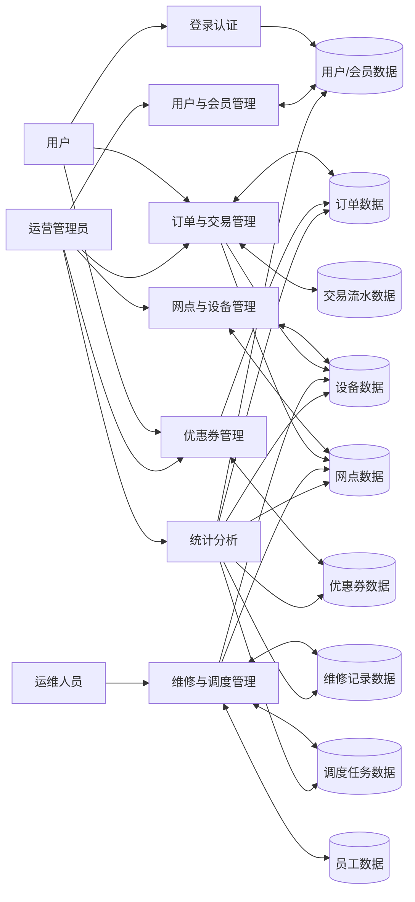
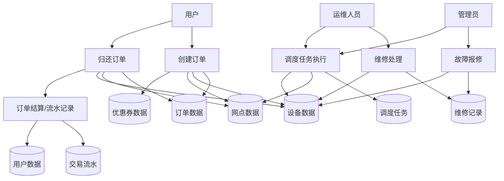

# 共享单车调度管理系统需求文档

## 1. 系统背景

### 1.1 项目背景
随着城市短途出行需求持续增长，共享单车已经成为校园、园区、地铁站周边和商业区的重要交通补充方式。共享单车系统在实际运营中不仅要解决“用户能否顺利借还车”的问题，还要解决“车辆是否分布均衡、设备是否可用、故障是否及时处理、营销活动是否有效、运营数据是否可视化”等管理问题。

本项目以“共享单车调度管理系统”为主题，建设一个面向运营管理场景的信息系统。系统采用前后端分离架构，前端使用 React，后端使用 Node.js + Express，数据库采用 MySQL。系统围绕用户、网点、设备、订单、优惠券、维修、调度等业务对象，形成较完整的共享单车运营闭环。

### 1.2 建设目标
本系统的建设目标如下：

1. 实现共享单车业务基础信息的统一管理。
2. 支持用户注册登录、车辆租借、订单管理等核心业务。
3. 支持网点容量监控、设备状态监控和维修记录管理。
4. 支持运营人员对车辆进行调度，缓解站点车辆分布不均的问题。
5. 支持优惠券发放与核销，体现营销管理能力。
6. 支持首页看板汇总展示，提升运营数据分析效率。

### 1.3 系统现状分析
结合当前项目代码与数据库脚本，系统已具备如下基础：

1. 后端已提供认证、用户、网点、设备、订单、优惠券、员工、维修、调度、看板等接口模块。
2. 前端已提供登录页、首页看板、用户中心、网点管理、设备管理、订单管理、优惠营销、运维调度等页面框架。
3. 数据库已设计 10 张核心业务表，可支撑课程实验的主要业务需求。

因此，本需求文档在现有项目基础上，进一步将业务目标、模块结构、数据流和功能要求进行规范化表达。

## 2. 系统功能结构图

### 2.1 系统总体功能
系统主要由登录认证、基础资料管理、业务交易管理、营销管理、运维调度管理和数据看板分析六大部分组成。

### 2.2 系统功能结构图

```text
共享单车调度管理系统
├─ 1. 登录认证模块
│  ├─ 用户注册
│  ├─ 用户登录
│  └─ 身份校验/会话维护
├─ 2. 用户与会员模块
│  ├─ 用户信息管理
│  ├─ 实名认证状态管理
│  ├─ 余额管理
│  ├─ 信用积分管理
│  └─ 会员等级管理
├─ 3. 网点与设备模块
│  ├─ 网点信息管理
│  ├─ 网点容量管理
│  ├─ 设备信息管理
│  ├─ 设备状态管理
│  └─ 电量/维修时间管理
├─ 4. 订单交易模块
│  ├─ 创建租借订单
│  ├─ 归还订单
│  ├─ 取消订单
│  ├─ 订单费用计算
│  └─ 交易流水记录
├─ 5. 优惠营销模块
│  ├─ 优惠券发放
│  ├─ 优惠券查询
│  ├─ 优惠券核销
│  └─ 优惠券失效处理
├─ 6. 运维调度模块
│  ├─ 员工信息管理
│  ├─ 维修记录管理
│  ├─ 调度任务创建
│  ├─ 调度任务接单
│  └─ 调度任务完成
└─ 7. 数据看板模块
   ├─ 用户总数统计
   ├─ 网点总数统计
   ├─ 设备总数统计
   ├─ 订单总数统计
   ├─ 已使用优惠券统计
   ├─ 调度任务统计
   └─ 待维修故障统计
```

## 3. 各模块功能描述

### 3.1 登录认证模块
该模块用于实现系统访问控制，是进入系统的统一入口。用户可以通过用户名或手机号登录系统，系统验证密码后生成令牌，前端通过令牌维护登录状态。

主要功能：

1. 用户注册。
2. 用户登录。
3. 当前登录用户信息查询。
4. 基于 Token 的身份验证。

### 3.2 用户与会员模块
该模块负责维护平台用户基础信息和会员等级信息，为订单、优惠券、账户余额和信用积分提供数据支持。

主要功能：

1. 维护用户基本资料，如用户名、手机号、姓名。
2. 管理实名认证状态。
3. 管理用户余额。
4. 管理信用积分。
5. 维护会员等级及折扣规则。

### 3.3 网点与设备模块
该模块负责维护共享单车投放网点与设备的静态和动态信息，是订单和调度的基础。

主要功能：

1. 维护网点编号、名称、地址、位置、容量等信息。
2. 维护设备编号、设备类型、硬件版本、电量、当前状态等信息。
3. 记录设备所属网点。
4. 反映网点空闲位和设备分布情况。

### 3.4 订单交易模块
该模块是系统的核心业务模块，负责共享单车租借、归还、费用记录及订单状态流转。

主要功能：

1. 创建租借订单。
2. 记录借车网点和还车网点。
3. 管理订单开始时间、结束时间和金额。
4. 支持订单归还和订单取消。
5. 记录账户资金流水。

### 3.5 优惠营销模块
该模块面向平台营销活动，支持优惠券的发放、绑定订单、核销和失效处理。

主要功能：

1. 创建优惠券信息。
2. 记录优惠券所属用户。
3. 订单使用优惠券时进行核销。
4. 对过期或停用优惠券进行失效处理。

### 3.6 运维调度模块
该模块体现系统的管理特征，用于解决设备故障、站点车辆失衡等问题。

主要功能：

1. 管理运维人员信息。
2. 记录设备报修、维修处理状态和维修结果。
3. 创建调度工单，指定来源站点和目标站点。
4. 调度人员接单执行任务。
5. 更新任务完成情况和完成时间。

### 3.7 数据看板模块
该模块用于对系统核心业务指标进行汇总展示，为运营人员提供管理依据。

主要功能：

1. 展示用户总量、网点总量、设备总量、订单总量。
2. 展示已使用优惠券数量。
3. 展示调度任务数量。
4. 展示待维修故障数量。

## 4. 系统主要需求和功能

### 4.1 功能性需求

#### 4.1.1 用户管理需求
1. 系统应支持用户注册与登录。
2. 系统应支持按用户编号查看用户详细信息。
3. 系统应支持对用户余额、信用积分、账户状态进行维护。
4. 系统应支持用户与会员等级之间的关联管理。

#### 4.1.2 网点管理需求
1. 系统应支持新增、查询、修改、删除网点信息。
2. 系统应记录网点位置、最大容量和空闲位数。
3. 系统应支持按关键字查询网点。

#### 4.1.3 设备管理需求
1. 系统应支持新增、查询、修改、删除设备信息。
2. 系统应记录设备所属网点、设备类型、电量、状态等信息。
3. 系统应支持设备状态查询，如空闲、使用中、维修中等。

#### 4.1.4 订单管理需求
1. 系统应支持创建订单。
2. 系统应支持订单归还处理。
3. 系统应支持订单取消处理。
4. 系统应记录订单预估金额与实际金额。
5. 系统应保存借车、还车网点及订单状态信息。

#### 4.1.5 优惠券管理需求
1. 系统应支持优惠券新增、查询、修改、删除。
2. 系统应支持优惠券与用户绑定。
3. 系统应支持订单核销优惠券。
4. 系统应支持优惠券失效处理。

#### 4.1.6 维修管理需求
1. 系统应支持新增维修记录。
2. 系统应记录故障类型、报修时间、维修状态、维修结果。
3. 系统应支持维修人员信息关联。

#### 4.1.7 调度管理需求
1. 系统应支持创建调度任务。
2. 系统应记录任务编号、调度人员、来源网点、目标网点、设备集合。
3. 系统应支持调度任务接单。
4. 系统应支持调度任务完成。

#### 4.1.8 看板统计需求
1. 系统应支持首页汇总指标展示。
2. 系统应支持统计用户、网点、设备、订单、优惠券、调度、维修等关键数据。

### 4.2 非功能性需求

1. 系统应采用前后端分离架构，便于维护与扩展。
2. 系统应具备基础权限控制，未登录用户不能访问业务页面。
3. 系统数据库应满足数据一致性和完整性要求，核心字段应设置主键、外键和索引。
4. 系统界面应简洁清晰，便于课程实验展示。
5. 系统应支持后续扩展真实业务逻辑，如费用规则、地图展示、实时调度算法等。

## 5. 数据分析

### 5.1 主要数据实体分析
结合当前数据库设计，系统包含以下 10 个核心数据实体：

1. `user_ranks`：会员等级实体，描述不同用户等级的折扣和押金策略。
2. `users`：用户实体，描述用户基本信息、余额、信用积分和账户状态。
3. `stations`：网点实体，描述网点位置、容量和可用泊位。
4. `equipments`：设备实体，描述车辆或设备的基础信息和当前状态。
5. `staffs`：员工实体，描述运维人员信息。
6. `maintenance_logs`：维修记录实体，描述设备故障和处理过程。
7. `promotion_coupons`：优惠券实体，描述营销优惠信息。
8. `orders`：订单实体，描述共享单车借还业务。
9. `transactions`：交易流水实体，描述资金变化过程。
10. `dispatch_tasks`：调度任务实体，描述车辆搬运与站点平衡任务。

### 5.2 数据关系分析

1. 一个会员等级可对应多个用户，`user_ranks` 与 `users` 为一对多关系。
2. 一个网点可拥有多台设备，`stations` 与 `equipments` 为一对多关系。
3. 一个用户可产生多个订单，`users` 与 `orders` 为一对多关系。
4. 一台设备可对应多个维修记录，`equipments` 与 `maintenance_logs` 为一对多关系。
5. 一个员工可处理多个维修记录和多个调度任务，`staffs` 与 `maintenance_logs`、`dispatch_tasks` 均为一对多关系。
6. 一个用户可拥有多个优惠券，`users` 与 `promotion_coupons` 为一对多关系。
7. 一个订单可关联一张优惠券，也可不使用优惠券。
8. 一个订单可产生一条或多条交易流水记录。
9. 一个调度任务关联来源网点和目标网点，并包含若干设备编号。

### 5.3 核心数据项分析

1. 用户数据：用户名、手机号、实名认证、余额、信用积分、等级编号。
2. 网点数据：网点编号、网点名称、地址、位置、最大容量、空闲位。
3. 设备数据：设备编号、设备类型、电量、硬件版本、设备状态、所属网点。
4. 订单数据：订单编号、用户编号、设备编号、起始网点、归还网点、开始时间、结束时间、金额、状态。
5. 优惠券数据：优惠券编号、优惠名称、面值、最低消费、过期时间、使用状态。
6. 维修数据：故障类型、故障描述、报修时间、维修状态、维修结果。
7. 调度数据：任务编号、调度员工、来源网点、目标网点、计划时间、开始时间、完成时间、任务状态。
8. 交易数据：交易流水号、交易类型、交易金额、变动前余额、变动后余额、交易渠道、交易状态。

## 6. 数据流图

### 6.1 顶层数据流图

```text
外部实体：
用户、运营管理员、运维人员

处理过程：
P1 登录认证
P2 用户与会员管理
P3 网点与设备管理
P4 订单与交易管理
P5 优惠券管理
P6 维修与调度管理
P7 统计分析

数据存储：
D1 用户/会员库
D2 网点库
D3 设备库
D4 订单库
D5 优惠券库
D6 交易流水库
D7 员工库
D8 维修记录库
D9 调度任务库
```

### 6.2 系统顶层数据流图表示



### 6.3 订单与调度子数据流图



## 7. 数据流图中的数据流、数据存储和数据出力说明

### 7.1 数据流说明

#### 7.1.1 登录认证数据流
用户输入账号和密码后，系统读取用户数据表进行身份校验。校验成功后输出登录结果和身份令牌，供前端后续访问接口时使用。

#### 7.1.2 用户管理数据流
管理员录入或修改用户信息后，用户资料、余额、信用积分和账户状态写入用户表；在查询时，系统从用户表和会员等级表读取并返回结果。

#### 7.1.3 网点与设备数据流
管理员维护网点和设备资料时，数据写入网点表和设备表；订单创建、归还、维修和调度过程中，也会读取或更新设备状态与网点容量数据。

#### 7.1.4 订单处理数据流
用户发起租借请求后，系统读取用户、设备、网点、优惠券等信息，生成订单记录；归还时系统更新订单结束时间、金额、归还网点，并同步更新设备状态和相关统计数据。

#### 7.1.5 优惠券处理数据流
系统发放优惠券时将优惠券写入优惠券表；用户下单使用优惠券时，系统读取优惠券状态并进行核销，核销结果反馈给订单模块。

#### 7.1.6 维修处理数据流
管理员或系统发现设备故障后，生成维修记录；运维人员处理后，系统更新维修状态、处理结果及设备状态。

#### 7.1.7 调度任务数据流
管理员根据网点车辆饱和或缺车情况创建调度任务，系统写入调度任务表；运维人员接单和完成任务时，系统更新任务状态，并根据需要更新设备与网点信息。

#### 7.1.8 统计分析数据流
首页看板从用户、网点、设备、订单、优惠券、维修、调度等数据表中读取统计结果，形成汇总信息后输出给管理页面。

### 7.2 数据存储说明

1. D1 用户/会员数据存储：对应 `users` 与 `user_ranks`，用于保存用户基本信息、等级、余额、信用积分等。
2. D2 网点数据存储：对应 `stations`，用于保存网点名称、位置、容量和状态信息。
3. D3 设备数据存储：对应 `equipments`，用于保存设备基础信息、所属网点、电量和设备状态。
4. D4 订单数据存储：对应 `orders`，用于保存借还车全过程数据。
5. D5 优惠券数据存储：对应 `promotion_coupons`，用于保存优惠券发放和使用情况。
6. D6 交易流水数据存储：对应 `transactions`，用于保存充值、支付、退款等资金变化过程。
7. D7 员工数据存储：对应 `staffs`，用于保存运维人员基础信息。
8. D8 维修记录数据存储：对应 `maintenance_logs`，用于保存故障与维修全过程信息。
9. D9 调度任务数据存储：对应 `dispatch_tasks`，用于保存车辆调度任务信息。

### 7.3 数据出力说明
数据出力是指系统对外输出的数据结果，主要包括以下几类：

1. 登录结果输出：输出登录成功或失败信息、用户身份信息、访问令牌。
2. 用户信息输出：输出用户列表、用户详情、会员等级信息、余额和信用状态。
3. 网点信息输出：输出网点位置、容量、空闲位和网点状态。
4. 设备信息输出：输出设备编号、类型、电量、设备状态、所属网点。
5. 订单信息输出：输出订单编号、借还车时间、订单状态、预估金额和实际金额。
6. 优惠券信息输出：输出优惠券编号、面值、使用状态、过期状态和关联订单信息。
7. 维修信息输出：输出故障类型、维修状态、维修结果和处理时间。
8. 调度任务输出：输出任务编号、执行人员、任务状态、调度时间和任务说明。
9. 统计报表输出：输出首页看板中的汇总指标，为系统管理和课程答辩提供支撑。

## 8. 结论
本系统以共享单车运营管理为核心，围绕“用户借还车业务”和“后台运维调度管理”两条主线展开，既体现了共享单车平台的基本业务流程，也体现了管理系统在调度、维修、营销和统计方面的扩展能力。

从当前项目实现情况来看，系统模块划分清晰，数据库结构完整，已经具备形成课程实验项目成果的基础。后续若继续完善，可进一步补充计费规则、地图展示、权限分级、调度策略和可视化分析等内容。
